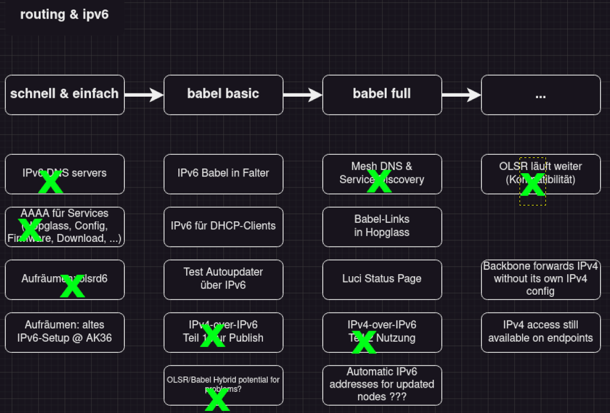

# FF Community Meeting 22.09.2024

_Es waren ca. 15 Leute vor Ort. Wir hatten ein angenehmes Treffen und sind gut durch die geplanten Punkte durchgekommen. Wir haben uns insgesamt 4 Stunden gemeinsam mit Programm und Essen getroffen. Danach gab es noch ein nettes Abhängen und Coworken mit den Leuten die Lust darauf hatten._

## State of the Netz

_Es wurde ein Video von Hener gezeigt, der die Statistiken aus dem letzten Jahr anschaut und für uns auswertet. Im Folgenden ein paar Notizen zu dem Beitrag._

  - Node stabil, kein Rückgang
    - 620 -> 651
  - Leases
    - Gleichbleibend, Leicht steigend
  - Neuer Falter-Release
    - 334 Router mit aktueller Firmware
    - ca. 160 bbb-router
    - bbb-configs
      - Babel-Migration
      - Neuer Namensservice: olsr -> ff
      - 2000 Commits
    - Maintenance
      - Teufelsberg
        - Wartung, Antennen-Ausrichtung, Technik-Tausch
      - Zwingli
        - Wartung, Antennen-Ausrichtung, Technik-Tausch
      - Vaterhaus
        - Wartung, Antennen-Ausrichtung, Technik-Tausch
        - meshtastic
      - Simeon
        - Core-Reouter tausch
      - bht
        - core Tausch
      - k9
        - Reaktiviert
      - emma
        - vollst. Taubenfrei
        - Plan: hübsch machen
    - Gigabit-Netz-Ring
      - Emma
        - Zwingli, rhnk
      - Ringschluss im Sommer
        - CCCB hat Interesse
      - Ring als Backup
    - Community-Arbeit
      - 2 Workshops
        - Sicheres Arbeiten auf Dächern
      - Hackday, Flash-Night, HdM aufgelöst, Testbed, Inventar, langfr. Raumperspektive
    - Wins & Fails
      - Wins
        - Firewall-Setup
          - Mgnt immer offen, vor-ort fixes minimieren
        - Emma
          - Taubenfrei
          - Reinigung folgt
      - Fails
        - Teufelsberg down (secrurity building offline)
          - alles gedroppt außer lan, gab nur vlan
            - vor-ort fix notwending
      - Gigabit via VLANs

## Maintenance 2025

_Noki hat eine Einführung in [uisp.ff](https://uisp.ff) gegeben und wir haben gemeinsam darüber diskutiert, wie die Maintenance Arbeit in Zukunft besser organisiert werden kann. Im Folgenden ein paar Notizen zu dem Beitrag._

  - Standort-Karte
    - Alle bbb-Standorte eingetrage
    - priv Standorte eingetragen
    - Beispiel
      - Eberswalder7, lange verschwunden, wann rauswurf aus Karte?
    - Viele Standorte mit Community-Only
      - Schwierig Ansprechpartner zu finden
    - DFS-Reset am Anang nicht kkonfiguriert
      - nachgezogen
      - DFS-Hits meist durch alte Geräte verursacht
      - Mehr Hits bei neuerer Firmware
        - einige neue Geräte herausgenommen
      - Norden Berlin Probleme
        - wenig 60 Ghz, bei DFS-Hits wenig re-routing Möglichkeiten
      - Vergleich Wetterradar in polnischen Städten
        - Sternmuster im Radarbild indiziert Störung durch WLAN
      - Vorschlag
        - Frequenzen/Nutzung in die bbb-configs schreiben
    - Ethernet-Issues
      - Bug bei Ubiquiti, 100M
      - LAN-Speed von 100M indiziert Ader-Fehler bei Lan-Kabeln
      - Issues ableiten!
      - Outdoor-fähige Kabel einsetzen, Alte/kaputte Kabel ersetzen
    - Monitoring
      - kein Alerting
      - wenig Leute schauen rein
      - Alerts hinterlegbar, ABER starker Email spam
      - Daten aus USP nach Grafana exportierbar?
        - evtl., komplex aber machbar
        - wenn möglich, nicht zwei monitoring-seiten haben
      - bbb-firmware-version
    - Hopglass-Karte renovieren
      - Status aus UISP einfließen lassen
    - Vorschlag
      - Standorte entslacken
        - nicht zu viele freie Antennenplätze freihalten
  - Problem: Wenn einzelne AP an einem großen Core ausfallen, fällt dies nicht immer früh auf
  - Vorschlag: Werbung für Maintanence-Issues
    - auf Community-Treffen Personen suchen, die in der Nähe wohnen

## Babel Migration

_Lars hat uns mit einer Präsentation gezeigt, was der aktuelle Stand der MIgration von olsr zu babel ist. Es wurde aufgezeigt was die neuen Funktionen sind und was Schwierigkeiten sind, die noch gelöst werden müssen. Im Folgenden die Folien seines Vortrags._

**Von OLSR zu Babel**

**Routen: Mesh & Default**

- IPv4 Mesh: 10.0.0.0/8
- IPv6 Mesh: 2001:bf7::/32
- IPv4 Default Route: 0.0.0.0/8
- IPv6 Default Route: ::/0

**August 2024: Los gehts**

- Angefangen IPv4 Mesh Routen in Babel zu announcen, IPv4 Default Route weiter über OLSR
- Problem: wie die Mesh Routen und Default Routen auseinanderhalten?
- Lösung: sofort beides in Babel announcen

**babeld vs. Bird**

- Vier separate Routing Tables:
  - OLSR: mesh & default route
  - Babel: mesh & default route
- Problem: die offizielle Babel impl (babeld) kann keine separaten Routing Tables
- Lösung: Wechsel zu Bird

**Metrics metrics metrics**

- Haufenweise kleine Metrics Fixes
- Problem: Bird behandelt Metrics andersrum wie babeld
- Lösung: Bird Patch von der Mailingliste

**Multihoming**

- ... ist wenn ein Netzwerk über mehrere Wege von der Außenwelt erreichbar ist
- AK36, Strom, L105, Saarbruecker, Ohlauer

**Gateway Firewall**

- Auf allen Gateways wird IPv4 geNATet, IPv6 wird durchgeroutet
- Stateful: connection tracking
- Stateless: filtern basierend nur auf Eigenschaften des Pakets
- Problem 0: kleine Bugs in der Firewall Config
- Problem 1: Synchronisierung des Trackings zwischen den Gateways
- Lösung: Stateless Firewall, einzelne Standort-Prefixe freischalten
- Problem 2: einzelne Standort-Prefixe freischalten
- Lösung: ???

**Domain Names**

- Bisher: OLSR nameservice plugin, nur IPv4
- Bisher: keine Domain Names für IPv6
- Kurzes Experiment mit OLSR 6
- Lösung: BGPdisco!

**Wie weiter**

- Stateless Firewalls @ Gateways
- BGPdisco resource usage
- [IPv6 Notizen von Simon](https://github.com/freifunk-berlin/bbb-configs/issues)

## Testlab

_Perry hat das von ihm gebaute Testlab mit seinen Funktionen vorgestellt. Dafür gab es eine mini Version, die vor Ort aufgebaut wurde. Mehr infos gibt es im [Labgrid repository](https://github.com/pmelange/labgrid). Im Folgenden einige Notizen zu der Vorstellung._

  - Hardware
    - Raspi 4
  - Router Setup
    - kleine Anpassungen pro Router notwendig
  - Automation & Tests
    - CI-Integration möglich
  - Test-Types
    - deamon running?
    - Proof-Of-Concept
    - Simulations
      - Build test-mesh-networks
      - throttle until breaks
  - Labgrid
    - fork of a github proj
    - zusätzliche module verfügbar
    - uci-config via Funktionen
    - Komponenten
      - coordinator, exporter, client
      - Client kann von überall aufgerufen werden
      - n-Clients können zum exporter verbunden sein
        - Simultantest möglich
          - z.B.: Perry kann Gerät 4 testen, während Noki Gerät 7 testet
  - pyTest
    - easy to write small test in python

## Vereinsgründung

_Der Verein Freifunktion wurde gegründet. Es haben sich sieben aktive Freifunker gefunden, um Mitglied des Vereins zu sein. Als nächstes wir die Eintragung ins Vereinsregister angestrebt. Beim nächsten Community Day wird berichtet, was der aktuelle Stand ist._
